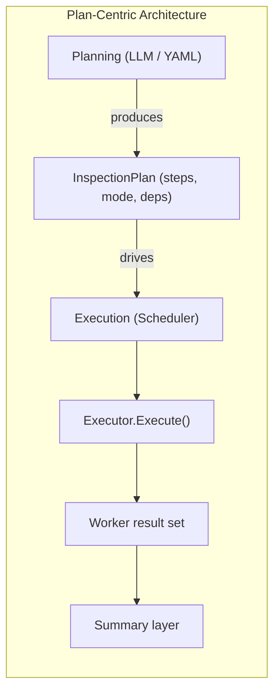
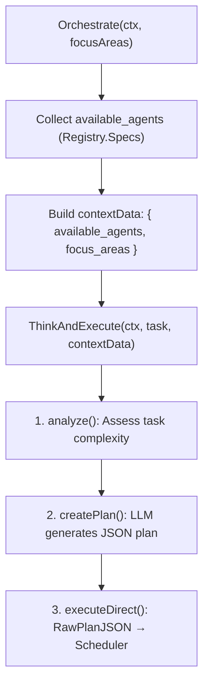
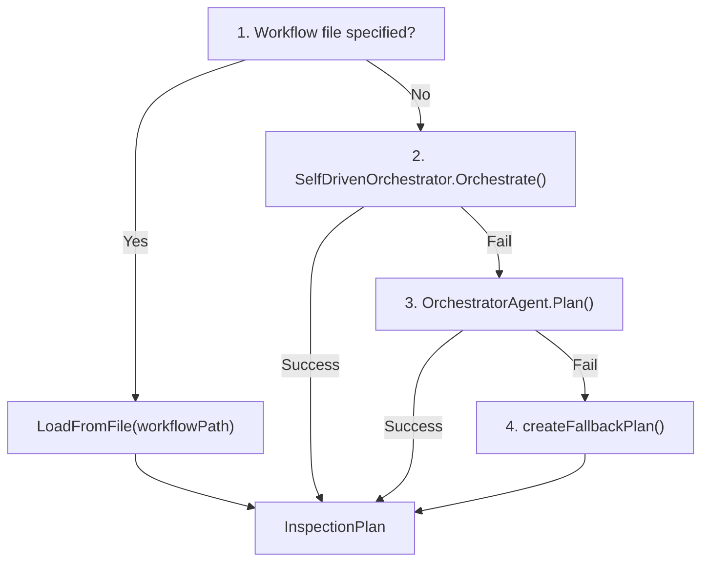
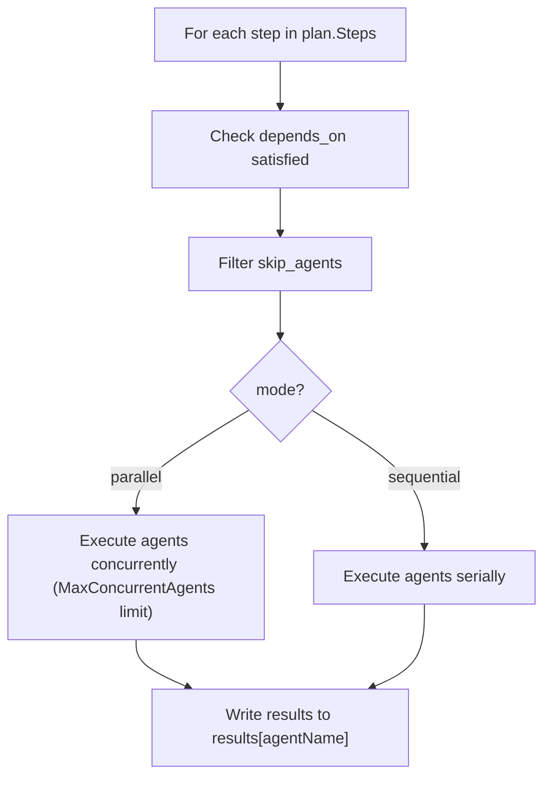

# Plan-Centric LLM Self-Driven Architecture

This document describes Kube Ops Agent's **Plan-centric** architecture—how LLM self-plans, how Plan drives execution, and the benefits of planning-execution separation.

## Core Concept

### Plan as Central Abstraction

All inspection execution revolves around **InspectionPlan**:

- **Planning layer**: Produces Plan (from LLM or static Workflow)
- **Execution layer**: Executes by Plan steps in order, agnostic to how it was generated
- **Summarization layer**: Generates report from Plan execution results



### Planning vs Execution Separation

| Responsibility | Planning Layer | Execution Layer |
|----------------|----------------|-----------------|
| Focus | What to do, order, dependencies | How to execute safely and reliably |
| Output | InspectionPlan | Per-agent text results |
| Failure handling | Can reselect, skip agents | Retry, circuit breaker, timeout |

The execution layer does not interpret task semantics; it only invokes agents by Plan steps. The planning layer does not care about execution details; it only produces structured plans. This separation enables:

- Swappable planning (LLM ↔ Workflow)
- Unified, reusable execution logic for different Plans
- Independent testing and debugging

---

## InspectionPlan Structure

### Full Schema

```json
{
  "assessment": "Cluster overall assessment description",
  "priority": "critical|high|normal|low",
  "reasoning": "Orchestration rationale",
  "allow_replan": false,
  "focus_areas": ["infrastructure", "workloads"],
  "skip_agents": ["AgentX"],
  "skip_reasoning": "Reason for skipping",
  "steps": [
    {
      "agents": ["AgentA", "AgentB"],
      "mode": "parallel|sequential",
      "focus_areas": ["nodes", "pods"],
      "depends_on": [],
      "condition": "Step description",
      "timeout_seconds": 300
    },
    {
      "agents": ["AgentC"],
      "mode": "sequential",
      "depends_on": ["AgentA"]
    }
  ]
}
```

### Field Reference

| Field | Type | Description |
|-------|------|-------------|
| `assessment` | string | Overall assessment goal for this inspection |
| `priority` | string | Priority; affects logging and alerts |
| `steps` | array | Execution steps, executed in order |
| `steps[].agents` | string[] | Agent names to invoke in this step |
| `steps[].mode` | string | `parallel` concurrent / `sequential` serial |
| `steps[].depends_on` | string[] | Prior agents this step depends on; step runs only after dependencies have results |
| `steps[].timeout_seconds` | int | Per-step timeout |
| `skip_agents` | string[] | Agents to skip for this inspection |
| `skip_reasoning` | string | Reason for skipping |
| `allow_replan` | bool | Whether to allow replanning on failure (reserved) |

### Execution Semantics

1. **Step order**: Execute steps in array order
2. **depends_on**: Agents listed in `depends_on` must have been executed and produced results in earlier steps
3. **mode**: `parallel` = agents in this step run concurrently (subject to `MaxConcurrentAgents`); `sequential` = serial
4. **skip_agents**: Global filter; not executed in any step

---

## LLM Self-Planning Flow

### SelfDrivenOrchestrator

Self-driven planning flow based on **ThinkingAgent**:



### OrchestratorAgent (Traditional)

Single LLM call, directly produces InspectionPlan JSON:

- Input: `available_agents` (name, description, focus_area, interval), `highLevelTask`
- Output: JSON conforming to schema, parsed by `plan.FromJSON`

### Planning Priority (Scheduler)



---

## Execution Flow

### Execute by Plan



### Execution Context Passing

Each step execution receives:

- `trigger`, `focus_areas`, `assessment`, `step_reason`, `plan_priority`
- Existing results from agents in `depends_on` (e.g. `ClusterOverview: "..."`)

Workers can adjust inspection focus or skip redundant steps based on this context.

---

## Dual-Track Agent System

### Worker Types

| Type | Driver | Use Case |
|------|--------|----------|
| **ReActAgent** | Skills + tool calls | Rule-based, scriptable inspection |
| **SelfDrivenWorker** | ThinkingAgent | Reasoning, dynamic decision-making |

Executor tries SelfDrivenWorker first; falls back to ReActAgent on failure.

### Orchestrator / Summary Dual Tracks

| Component | Traditional | SelfDriven |
|-----------|-------------|------------|
| Orchestrator | OrchestratorAgent | SelfDrivenOrchestrator |
| Summary | SummaryAgent | SelfDrivenSummary |

Intelligent mode prefers SelfDriven versions for better planning and summarization.

---

## Design Benefits

1. **Swappability**: Planning (LLM / Workflow) can be switched without changing execution logic
2. **Observability**: Plans can be persisted and audited; easier to debug "why it ran this way"
3. **Extensibility**: New agents only need to be referenced in Plan; no execution code changes
4. **Testability**: Static Plans can drive execution without real LLM

---

## Related Docs

- [Architecture](architecture.md) - System layers and component relationships
- [Usage Guide](usage-guide.md) - LLM planning and Workflow configuration
- [Workflow Configuration](workflow-config.md) - Workflow YAML format
