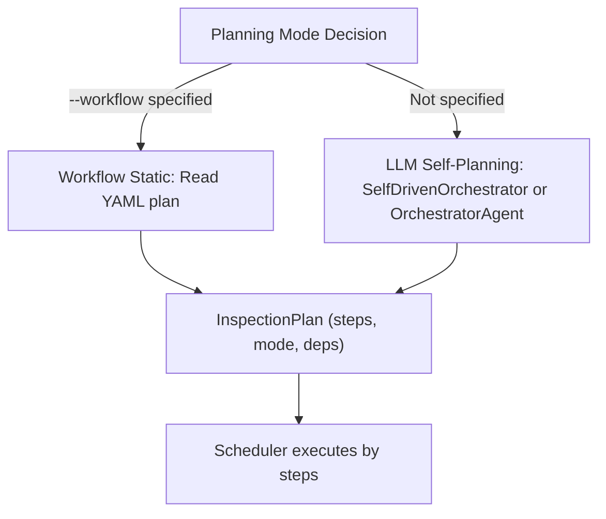

# Usage Guide

This document covers daily usage of Kube Ops Agent, focusing on **LLM self-planning** vs **Workflow static orchestration**—when to use each and how to configure.

## Table of Contents

- [Planning Mode Overview](#planning-mode-overview)
- [LLM Self-Planning (Default)](#llm-self-planning-default)
- [Workflow Static Orchestration](#workflow-static-orchestration)
- [Mode Selection](#mode-selection)
- [Common Config and Commands](#common-config-and-commands)

---

## Planning Mode Overview

Before inspection runs, the system must decide "which agents to call" and "in what order." Two planning modes:

| Mode | Trigger | Planning Source | Use Case |
|------|---------|-----------------|----------|
| **LLM Self-Planning** | Default (no workflow specified) | SelfDrivenOrchestrator / OrchestratorAgent | Flexible, adapts to task changes |
| **Workflow Static Orchestration** | Explicit `--workflow` or `K8SOPS_WORKFLOW` | Predefined YAML file | Fixed flow, fewer LLM calls |



---

## LLM Self-Planning (Default)

### Characteristics

- **Zero config**: Works out of the box, no workflow file needed
- **Dynamic decisions**: Plan generated from available agents, task description, focus_areas
- **Skippable**: Can choose not to call some agents (`skip_agents`)
- **Dependencies and parallelism**: Supports `depends_on`, `parallel`/`sequential`

### Planning Chain

1. **SelfDrivenOrchestrator** (preferred): Self-driven planning via ThinkingAgent; analyzes task and agents, outputs JSON plan
2. **OrchestratorAgent** (fallback): Traditional LLM planning; directly produces InspectionPlan JSON
3. **Fallback**: If both fail, run all agents in parallel

### Usage

```bash
# Default is LLM planning, no extra args
k8sops

# Or explicitly no workflow (same as default)
k8sops --workflow ""
```

### Environment Variables

| Variable | Description | Default |
|----------|-------------|---------|
| `K8SOPS_WORKFLOW` | Workflow file path; empty = LLM planning | empty |
| `OPENAI_MODEL` | LLM model; affects planning quality | gpt-4o-mini |
| `K8SOPS_SKILLS_DIR` | Skills directory; determines available agents | kubernetes-ops-agent/skills |

---

## Workflow Static Orchestration

### Characteristics

- **Fixed flow**: Execution order, parallel/sequential, dependencies predefined
- **No LLM planning call**: Saves one LLM request in orchestration phase
- **Versionable**: YAML can be in Git for audit and rollback

### Usage

```bash
# Via CLI
k8sops --workflow kubernetes-ops-agent/workflow.yaml

# Via env
export K8SOPS_WORKFLOW=kubernetes-ops-agent/workflow.yaml
k8sops
```

### YAML Format

See [Workflow Configuration](workflow-config.md). Brief example:

```yaml
assessment: "Full cluster health inspection"
priority: normal
reasoning: "Static workflow: infrastructure -> workloads -> resources"

steps:
  - agents: [ClusterOverview, NodeHealth]
    mode: parallel
    focus_areas: [infrastructure]

  - agents: [PodsHealth, DeploymentsStatus]
    mode: parallel
    focus_areas: [workloads]

  - agents: [ClusterResources]
    mode: sequential
    depends_on: [ClusterOverview]
```

### When to Use Workflow

- Need **strictly fixed** execution order (e.g. compliance audit)
- Want to **reduce LLM calls** for cost or latency
- Have **mature inspection flow** to codify

---

## Mode Selection

| Scenario | Recommended Mode |
|----------|------------------|
| Daily inspection, exploratory checks | LLM self-planning |
| After adding/removing agents, want auto-adapt | LLM self-planning |
| Compliance/audit needs fixed steps | Workflow |
| Cost-sensitive, want fewer LLM calls | Workflow |
| Quick validation of new agent | Either; LLM more flexible |

**Principle**: Prefer LLM self-planning; use Workflow only when you have fixed flow or cost constraints.

---

## Common Config and Commands

### Startup Args

```bash
k8sops \
  --skills-dir kubernetes-ops-agent/skills \
  --report-dir kubernetes-ops-agent/report \
  --workflow ""                    # empty=LLM planning; or YAML path
  --no-intelligent                 # Use simple interval mode
  --interval-positive-only         # Only register agents with interval_seconds>0
  --log-level DEBUG
```

### Scheduling Modes

- **Intelligent** (default): Orchestrator generates plan, executes by steps
- **Simple** (`--no-intelligent`): Execute when `interval_seconds` expires, no planning

### HTTP Trigger

```bash
# Trigger full inspection
curl -X POST http://localhost:8080/trigger

# Optional: Only trigger specific agents
curl -X POST http://localhost:8080/trigger \
  -H "Content-Type: application/json" \
  -d '{"agent_names": ["ClusterOverview", "NodeHealth"]}'
```

### Health and Metrics

- `/health`: Service status, circuit breaker info
- `/metrics`: Concurrency, execution counts, etc.
