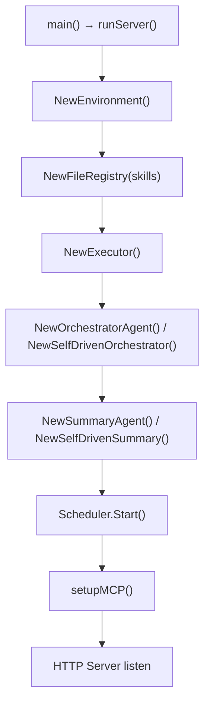
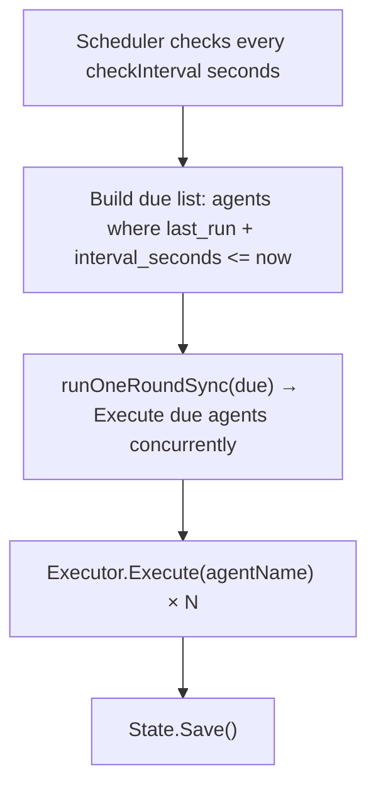
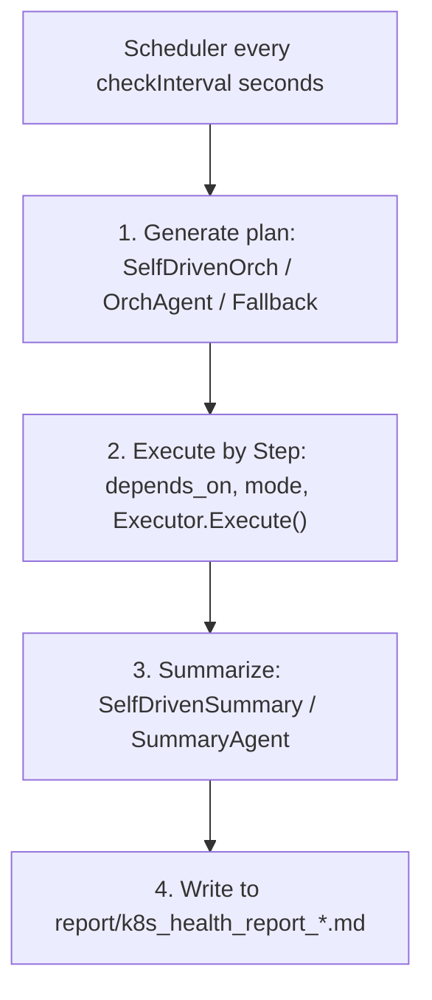
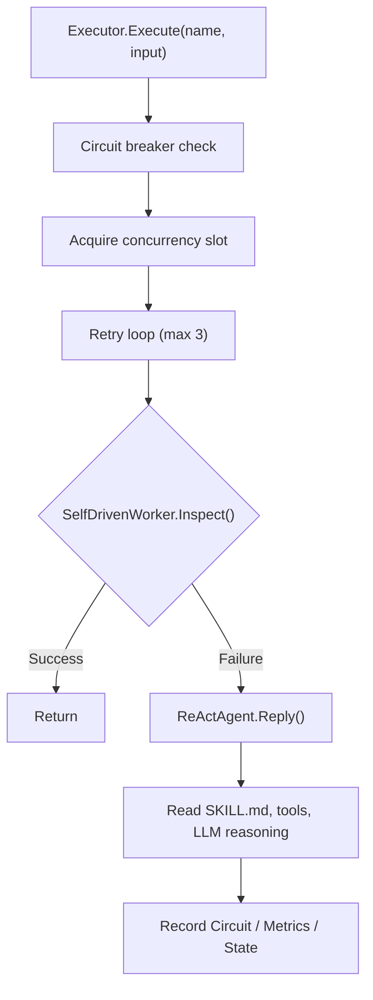
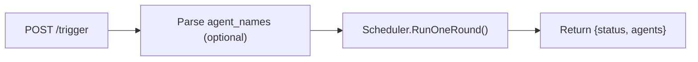
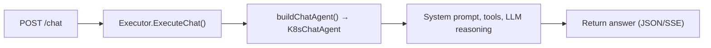

# Workflow

## 1. Startup Flow



## 2. Simple Mode

For fixed-interval scheduled inspection:



## 3. Intelligent Mode

Orchestrator dynamically generates plans with step dependencies and parallel/sequential execution:



## 4. Plan Structure (InspectionPlan)

```json
{
  "assessment": "Cluster overall assessment",
  "priority": "critical|high|normal|low",
  "steps": [
    {
      "agents": ["AgentA", "AgentB"],
      "mode": "parallel",
      "focus_areas": ["nodes", "pods"],
      "depends_on": [],
      "condition": "Optional condition description",
      "timeout_seconds": 300
    },
    {
      "agents": ["AgentC"],
      "mode": "sequential",
      "depends_on": ["AgentA"]
    }
  ],
  "skip_agents": ["AgentX"],
  "skip_reasoning": "Reason for skipping"
}
```

## 5. Worker Execution Flow



## 6. HTTP Trigger Flow



## 7. Chat Flow


